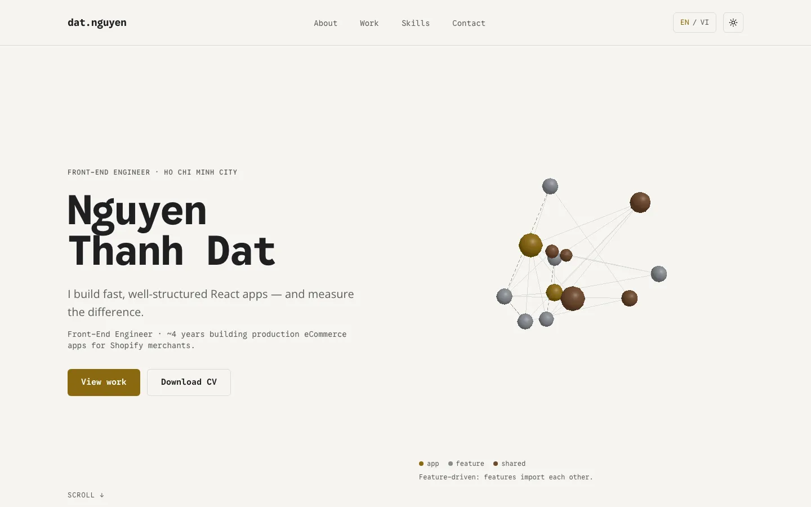

# Portfolio — Nguyen Thanh Dat



**Live URL:** https://portfolio-zeta-cyan-13.vercel.app

## What it is

A bilingual (English / Vietnamese) portfolio of Nguyen Thanh Dat, a front-end
engineer building Shopify apps with React and TypeScript. It presents three
case studies, an interactive 3D graph in the Hero and a 3D avatar in About,
with static fallbacks for every 3D and motion feature.

## Stack

Next.js 16 (App Router; production builds use webpack), React 19, TypeScript,
Tailwind CSS 4, next-intl 4, Velite (MDX content), GSAP + Lenis, three.js +
React Three Fiber, Zustand, Vitest, Playwright, Lighthouse CI.

## Architecture

Layering is `app → features → shared`; a lower layer never imports a higher
one (enforced by `eslint-plugin-boundaries`). Server Components are the
default. Conventions for contributors and AI-assisted changes live in
`CLAUDE.md`; plans and specs in `docs/`.

- `src/app` — routes (`[locale]` pages, sitemap, robots, OG images) and the
  single motion root (`_motion`).
- `src/features/{about,contact,hero,layout,skills,work}` — page sections and
  their feature-specific motion and 3D code.
- `src/shared/{animation,content,i18n,lib,mdx,seo,theme,three,ui}` — generic
  building blocks: motion markers, content access, i18n, site config, MDX
  rendering, SEO helpers, theme, 3D quality tiers, UI primitives.
- `content/` — case studies (MDX), validated at build time.

## 3D approach

### Hero graph

The Hero shows an illustrative node graph of a monorepo's packages. At the
top of the page it is a tangle with feature ↔ feature imports; scrolling
through the Hero snaps it into three layers (app → feature → shared) — the
migration from the Oneloyalty case study, told without words.

- **Loading.** A static SVG of the graph renders on the server. The canvas
  (three.js + React Three Fiber) loads lazily: on desktop after `load` + idle,
  on touch/narrow screens only after the first interaction.
- **Tiers.** High / Medium (fine pointer; dpr up to 1.5 / 1.25, 13 nodes,
  labels, hover, push, parallax) and Low (touch or narrow slot; dpr 1,
  10 nodes, no labels or interaction). `PerformanceMonitor` only ever
  steps down; at Low, only a sustained window under 25 fps switches the
  canvas off.
- **Fallback.** No JS, reduced motion, no WebGL, Save-Data, context loss or
  an error all end in the static "layered" SVG; the caption carries the
  meaning as text either way.
- **Measured budgets.** Initial JS 143.2 KB gzip (≤ 150); 3D chunk 249.6 KB
  gzip (≤ 250, ≈ 0.4 KB headroom; the avatar lives in About's own lazy
  `about-avatar` chunk, 25.5 KB, ≤ 26); 3 draw calls (2 once the cross edges
  fade; ≤ 6); 60 fps on desktop (headless Chromium with SwiftShader software GL, 5 s `requestAnimationFrame`
  count, so vsync-bound and not a real-GPU figure); mobile fps: **TODO (owner):
  measure on a real Android phone and iPhone**; Lighthouse mobile Performance
  0.95 (`/en`), 0.92 (`/vi`), 0.93–0.97 (case studies); LCP element on
  mobile: the hero intro paragraph (`<p class="text-fg-muted text-lg ...">` in `#top`),
  the same element as on `master` without Phase 5. With the canvas live on
  desktop it is the `h1`.
  Lazy motion chunk 55.4 KB gzip.
- **Lighthouse note.** Simulated mobile LCP is 2.7–3.4 s on every URL, so
  `largest-contentful-paint ≤ 2500` is asserted at `warn` (see Quality gates).
  Real-user LCP from Speed Insights is the launch KPI.
- **Visual snapshots.** `e2e/hero-3d-visual.spec.ts` snapshots the static
  fallback graph (390/1440 px, light/dark). Baselines are platform-specific,
  so it runs locally only (`pnpm exec playwright test e2e/hero-3d-visual.spec.ts`).

### About avatar

The About section shows a 3D avatar that waves once when the section scrolls
into view. It lives in its own lazy `about-avatar` chunk (≤ 26 KB gzip beyond
what the Hero already loaded), mounts only after the first scroll, renders
only while on screen, and falls back to a static image without WebGL, with
reduced motion or on error. At most two WebGL contexts exist at once.

## i18n

next-intl with two locales, `/en` and `/vi`. UI copy lives in
`src/shared/i18n/messages/{en,vi}.json`; a unit test keeps both catalogs'
key trees and placeholders identical. A case study without a published
Vietnamese version falls back to English with a notice; that page is
canonicalised to `/en` and left out of hreflang and the sitemap. hreflang
comes only from `buildMetadata` (next-intl's `alternateLinks` is off), so a
fallback page never advertises `/vi`. next-intl's `NEXT_LOCALE` cookie is off
too (`localeCookie: false`): the locale lives in the URL, and `/` redirects by
`Accept-Language` on every visit.

**Known limitation: 404 pages.** A `notFound()` (unknown path, case study
or post) returns status 404 with Next's `<html id="__next_error__">` shell;
the client renders the localized not-found page from the RSC payload. The
layout's inline scripts (theme, Umami loader, click tracking) never run on
that document, even after "Back home" navigates client-side, so 404 visits
are not tracked and use the default theme until the next full page load.
This predates Phase 6B; fixing it needs a different 404 architecture (for
example `global-not-found`).

## Content model

Case studies are `content/work/<slug>.<locale>.mdx`, validated by
`workFrontmatter` (`src/shared/content/work-schema.ts`) via `velite build --strict`:

- `slug`, `locale` (`en` | `vi`)
- `title` (≤ 60 chars), `summary` (shown on the page), `description` (140–160 chars, meta/OG only)
- `role`, `team?`, `company?`, `period` (`{ start, end? }`, `YYYY-MM`)
- `stack` (tags), `metrics` (1–4 `{ value, label }`; the first is the headline)
- `links` (`appStore`, `live`, `github`, `demo`; all optional URLs)
- `dateModified?`
- `draft?` — `true` hides a translation in production builds (it behaves like
  a missing one) and shows it in `pnpm dev` for review. Publish by deleting
  the line; tests derive their expectations from the files.

MDX bodies may use `<Image src width height alt />` (rendered with
`next/image`, lazy, fixed size).

## Feature flags

`site.features.blog` in `src/shared/lib/site.ts` is `false`: the header has no
Blog link, `/[locale]/blog/**` returns 404 and the sitemap has no blog URLs.
To launch the blog, set it to `true` and add posts as
`content/blog/<slug>.<locale>.mdx` — no other code change.

## Scripts

| Script                         | What it does                                                                                         |
| ------------------------------ | ---------------------------------------------------------------------------------------------------- |
| `pnpm dev`                     | Velite + Next dev server (Turbopack)                                                                 |
| `pnpm build`                   | Velite + production build (`next build --webpack`)                                                   |
| `pnpm start`                   | Serve the production build                                                                           |
| `pnpm lint`                    | ESLint, including layer boundaries                                                                   |
| `pnpm typecheck`               | Velite + `tsc --noEmit`                                                                              |
| `pnpm test`                    | Velite + Vitest unit tests                                                                           |
| `pnpm test:e2e`                | Playwright (builds and starts the app locally)                                                       |
| `pnpm check:claims`            | Fails if a retracted claim appears in the build, content or messages                                 |
| `pnpm check:bundles`           | Initial JS ≤ 150 KB gzip for `/en` and `/vi`, no three.js in initial chunks (run after `pnpm build`) |
| `pnpm lhci`                    | Lighthouse CI against a local production server                                                      |
| `pnpm format` / `format:check` | Prettier                                                                                             |
| `pnpm knip`                    | Unused files and exports                                                                             |

## Analytics

- **No cookies at all.** Umami is cookieless, and next-intl's locale cookie is
  off. e2e checks every document response for `Set-Cookie`.
- **Umami Cloud**, with `data-do-not-track` and `data-exclude-hash` (in-page
  anchors push their hash, which Umami would otherwise count as pageviews). It
  sends only from the Vercel production build (`data-domains` is the site
  host; previews and local builds get a never-matching domain), to
  `gateway.umami.is/api/send`. It is injected by an inline loader on the first
  `scroll`, `pointermove`, `pointerdown`, `keydown`, `touchstart` or `click`
  (a screen reader's virtual cursor may only click), like the motion chunk, so
  Lighthouse never loads it. Clicks before it arrives are queued on
  `window.__umamiQueue` and flushed once it loads. Cost: a visit with no input
  at all records no pageview. It is not `next/script`, which adds
  1.6 KB to the initial JS.
- **Vercel Speed Insights** renders only on Vercel (`VERCEL=1`); elsewhere its
  script URL returns 404. Its client component still adds about 1.25 KB gzip
  to the layout chunk on every deployment, even where it doesn't render
  (measured in Lighthouse's script-size context: removing it took `/en` from
  155,039 B to 153,798 B). Vercel Web Analytics is deliberately off.
- **Events.** Mark an element with `trackAttrs()` (`src/shared/analytics/events.ts`);
  code with no DOM element calls `track()` (`track.ts`). Never use
  `data-umami-event`: it cancels same-tab clicks.

| Event               | Props                                                                        | Fired by                                                    |
| ------------------- | ---------------------------------------------------------------------------- | ----------------------------------------------------------- |
| `cta_view_work`     | none                                                                         | Hero "view work" CTA                                        |
| `cv_download`       | `location`: `hero` or `contact`                                              | CV download links                                           |
| `email_copy`        | none                                                                         | Copy-email button                                           |
| `case_study_open`   | `slug`                                                                       | Case study links                                            |
| `outbound_click`    | `target`: `linkedin`, `github`, `repo`, `appStore`, `live`, `demo`, `source` | External links (`source` is a case study's own GitHub link) |
| `avatar_wave_click` | none                                                                         | Clicking the About avatar                                   |
| `locale_switch`     | `to`: `en` or `vi`                                                           | Locale switcher                                             |

## Security headers

Built per environment in `src/shared/security/headers.ts` and applied by
`next.config.ts`: `Content-Security-Policy`, `X-Content-Type-Options: nosniff`,
`Referrer-Policy: strict-origin-when-cross-origin`, `Permissions-Policy`
(camera, microphone, geolocation off), `X-Frame-Options: DENY`, and
`Strict-Transport-Security` in production only. The CSP is static (no nonces,
so pages stay static). Development adds `'unsafe-eval'` and `ws:`; production
adds HSTS and `upgrade-insecure-requests`. `connect-src` includes `blob:`
because `GLTFLoader` fetches the avatar's embedded textures from blob URLs,
and `https://gateway.umami.is`, where the Umami Cloud tracker sends events.
An e2e test runs a vendored copy of the real tracker
(`e2e/fixtures/umami-script.js`, MIT) against the CSP; refresh it when Umami
changes its script.

Everything except `nosniff` is skipped for `/_next/static/*`: Lighthouse counts
response headers in script transfer size, and those headers do nothing on a JS
file.

To change a CSP host, capture the network traffic of a real deployment first.
Never add a wildcard host, and never add `'unsafe-eval'` outside development.

## Quality gates

CI (`.github/workflows/ci.yml`) runs on every pull request:

- `checks`: lint, typecheck, unit tests, build, `check:claims`, `check:bundles`.
- `e2e (<project>)` for each Playwright project below.
- `lhci`: Lighthouse CI on a local production server.
- `lighthouse-preview` (`lighthouse-preview.yml`): the same assertions against
  each Vercel preview deployment.

Playwright projects (`playwright.config.ts`):

| Project                   | Runs                                     | Excludes                                                          |
| ------------------------- | ---------------------------------------- | ----------------------------------------------------------------- |
| `chromium`                | everything else, incl. the visual specs  | `hero-3d-no-webgl`, `hero-3d`, `about-avatar`; visual specs on CI |
| `chromium-webgl`          | `hero-3d`, `about-avatar`, one at a time | the rest                                                          |
| `chromium-no-webgl`       | `hero-3d-no-webgl` only                  | the rest                                                          |
| `firefox`, `webkit`       | non-WebGL specs                          | WebGL spec files, `@webgl`                                        |
| `iphone-13`, `pixel-7`    | non-WebGL specs                          | WebGL spec files, `@webgl`, `@desktop`                            |
| `chromium-reduced-motion` | non-WebGL specs                          | WebGL spec files, `@webgl`, `@motion`                             |

WebGL spec files are `hero-3d`, `hero-3d-visual`, `about-avatar` and
`about-avatar-visual`. The CI job `e2e (chromium)` runs `chromium`, then
`chromium-webgl` alone in a second step: SwiftShader sharing the runner's CPU
(with other WebGL specs or any other tests) lets the avatar's
PerformanceMonitor drop it to the static image mid-intro. The
`*-visual` specs only run locally (darwin-only snapshot baselines).

Lazy-chunk budgets are enforced by e2e: 3D chunk ≤ 250 KB gzip, About chunk
≤ 26 KB, motion chunk ≤ 70 KB. `check:bundles` enforces initial JS ≤ 150 KB.

Lighthouse thresholds (`lighthouserc.json`, mobile, 3 runs): Performance ≥ 0.9,
Accessibility ≥ 0.95, Best Practices = 1, SEO = 1, script size ≤ 150 KB,
TBT ≤ 200 ms, CLS ≤ 0.1, all `error`. The exception is LCP ≤ 2500 ms, which is
a `warn`: Lighthouse's simulated mobile LCP has a floor of 2.6–2.9 s, measured
with the ~130 KB framework runtime and nothing else loading (every font and
image blocked); the 2.7–3.4 s above is the normal page. The observed LCP is
40–80 ms. Real-user LCP from Speed Insights is the KPI.

**Preview bypass.** Preview deployments are protected, so the workflow sends
the `x-vercel-protection-bypass` header (secret `VERCEL_AUTOMATION_BYPASS_SECRET`)
plus `x-vercel-skip-toolbar`. The secret is scrubbed from the report artifacts
before upload, and the workflows have `permissions: contents: read`. Accepted
risk: the header goes with every request of the audit, third-party requests
included (the secret only opens previews of a public site, and Umami does not
load without input).

**Required checks on `master`.** GitHub counts a skipped required check as
passing. `lighthouse-preview` therefore also runs, and fails with "Preview
deployment failed", when the Vercel deployment fails or errors. It is still
skipped for Vercel's `pending` / `in_progress` events, and that skipped run
reports the check as passed until the deployment finishes, so a PR is
mergeable while its preview is still building (or if Vercel renames the
environment and the `Preview` filter stops matching). Requiring Vercel's own
commit status closes that gap: it stays pending until the deployment is
done and fails with it. Open any PR, copy the exact context name Vercel posts
there (for example `Vercel`), and put it in `contexts` below in place of
`<Vercel status context>`. Run once, as the repo admin:

```bash
gh api -X PUT repos/nguyenthanhdat22012001/Portfolio/branches/master/protection --input - <<'EOF'
{
  "required_status_checks": {
    "strict": true,
    "contexts": [
      "checks",
      "e2e (chromium)", "e2e (chromium-no-webgl)", "e2e (firefox)", "e2e (webkit)",
      "e2e (iphone-13)", "e2e (pixel-7)", "e2e (chromium-reduced-motion)",
      "lhci", "lighthouse-preview", "<Vercel status context>"
    ]
  },
  "enforce_admins": false,
  "required_pull_request_reviews": null,
  "restrictions": null
}
EOF
```

## Environment variables

| Variable                          | Required      | Purpose                                                                     |
| --------------------------------- | ------------- | --------------------------------------------------------------------------- |
| `NEXT_PUBLIC_SITE_URL`            | in production | Site origin for canonical URLs, hreflang, the sitemap and OG images         |
| `NEXT_PUBLIC_UMAMI_ID`            | optional      | Umami website ID; Production only in Vercel. No analytics script without it |
| `VERCEL_AUTOMATION_BYPASS_SECRET` | CI            | GitHub Actions secret for preview Lighthouse and `PLAYWRIGHT_BASE_URL` runs |
| `GOOGLE_SITE_VERIFICATION`        | optional      | Search Console verification meta tag                                        |
| `PLAYWRIGHT_BASE_URL`             | optional      | Run e2e against a deployment instead of a local build                       |

## Credits

- Fonts: Open Sans and Google Sans Code (Google Fonts, SIL Open Font License;
  the OG image bundles Open Sans Bold with its `OFL.txt`).
- The avatar was generated with Meshy under a private license; no
  attribution required.

## License

All rights reserved. The code may be read for reference; the content, the
avatar and the CV are not licensed for reuse.
